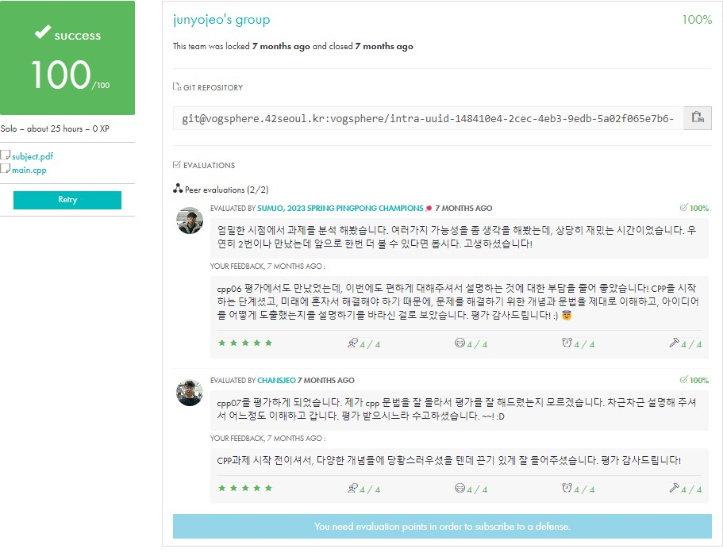

<div align="center">
  <h1>💻 CPP Module 07</h1>
  <p>C++ 템플릿 | 제네릭 프로그래밍</p>

  
  
  <div>
    
    
  </div>

  ### 학습 내용
  - 함수 템플릿 구현
  - 클래스 템플릿 설계
  - 템플릿 특수화
  - 템플릿 매개변수 추론
  - STL 컨테이너와 반복자 활용
</div>

## 🚀 Quick Start
```bash
make && ./whatever
```

## 📋 목차
1. [개요](#-개요)
2. [구현 요구사항](#-구현-요구사항)
3. [템플릿 프로그래밍](#-템플릿-프로그래밍)
4. [테스트 방법](#-테스트-방법)
5. [주의사항](#-주의사항)
6. [평가 준비](#-평가-준비)
7. [참고자료](#-참고자료)

## 🎯 개요
> C++ 템플릿 프로그래밍을 학습하는 프로젝트입니다.

### 프로젝트 구조
```
📦 CPP-Module-07
 ├── 📜 ex00/
 │   ├── whatever.hpp       # 함수 템플릿 구현
 │   └── main.cpp
 ├── 📜 ex01/
 │   ├── iter.hpp          # 배열 반복 템플릿
 │   └── main.cpp
 └── 📜 ex02/
     ├── Array.hpp         # 배열 클래스 템플릿
     └── main.cpp
```

## 💡 구현 요구사항
> 템플릿을 활용한 제네릭 프로그래밍을 구현합니다.

### ex00: 기본 함수 템플릿
```cpp
template <typename T>
void swap(T& a, T& b);

template <typename T>
T min(T const& a, T const& b);

template <typename T>
T max(T const& a, T const& b);
```

### ex01: 배열 반복자
```cpp
template <typename T, typename Func>
void iter(T* array, size_t length, Func f);
```

### ex02: 배열 클래스
```cpp
template <typename T>
class Array {
private:
    T* _array;
    unsigned int _size;

public:
    Array();
    Array(unsigned int n);
    Array(const Array& other);
    ~Array();
    
    Array& operator=(const Array& other);
    T& operator[](unsigned int index);
    unsigned int size() const;
};
```

## 🔄 템플릿 프로그래밍
> 타입에 독립적인 제네릭 코드를 작성합니다.

### 1. 함수 템플릿
```cpp
// 기본 문법
template <typename T>
void swap(T& a, T& b) {
    T temp = a;
    a = b;
    b = temp;
}

// 사용 예시
int a = 2, b = 3;
swap(a, b);           // int 타입으로 인스턴스화
double x = 3.14, y = 2.72;
swap(x, y);          // double 타입으로 인스턴스화
```

### 2. 클래스 템플릿
```cpp
template <typename T>
class Array {
private:
    T* _array;
    unsigned int _size;

public:
    // 예외 클래스
    class OutOfBoundsException : public std::exception {
        const char* what() const throw() {
            return "Index out of bounds";
        }
    };

    // 범위 검사가 포함된 배열 접근
    T& operator[](unsigned int index) {
        if (index >= _size)
            throw OutOfBoundsException();
        return _array[index];
    }
};
```

### 3. 템플릿 특수화
```cpp
// 문자열에 대한 특수화 예시
template <>
void iter<std::string>(std::string* array, size_t length, void (*f)(std::string&)) {
    for (size_t i = 0; i < length; i++)
        f(array[i]);
}
```

### 4. 반복자 활용
```cpp
template <typename T>
void printArray(const Array<T>& arr) {
    for (unsigned int i = 0; i < arr.size(); i++) {
        std::cout << arr[i];
        if (i < arr.size() - 1)
            std::cout << ", ";
    }
    std::cout << std::endl;
}
```

## 🔍 테스트 방법
> 각 exercise별 테스트를 수행합니다.

### ex00: whatever
```cpp
int main() {
    int a = 2;
    int b = 3;
    
    ::swap(a, b);
    std::cout << "a = " << a << ", b = " << b << std::endl;
    std::cout << "min(a, b) = " << ::min(a, b) << std::endl;
    std::cout << "max(a, b) = " << ::max(a, b) << std::endl;
    
    std::string c = "chaine1";
    std::string d = "chaine2";
    
    ::swap(c, d);
    std::cout << "c = " << c << ", d = " << d << std::endl;
    std::cout << "min(c, d) = " << ::min(c, d) << std::endl;
    std::cout << "max(c, d) = " << ::max(c, d) << std::endl;
}
```

#### 실행 결과
```bash
a = 3, b = 2
min(a, b) = 2
max(a, b) = 3
c = chaine2, d = chaine1
min(c, d) = chaine1
max(c, d) = chaine2
```

### ex01: iter
```cpp
template <typename T>
void print(T& x) {
    std::cout << x << " ";
}

int main() {
    int arr[] = {1, 2, 3, 4, 5};
    std::string strs[] = {"Hello", "42", "World"};
    
    iter(arr, 5, print<int>);
    std::cout << std::endl;
    
    iter(strs, 3, print<std::string>);
    std::cout << std::endl;
}
```

#### 실행 결과
```bash
1 2 3 4 5
Hello 42 World
```

### ex02: Array
```cpp
int main() {
    try {
        Array<int> numbers(5);
        for (unsigned int i = 0; i < numbers.size(); i++)
            numbers[i] = i;
            
        Array<std::string> strings(3);
        strings[0] = "Hello";
        strings[1] = "42";
        strings[2] = "World";
        
        // 범위 초과 테스트
        numbers[5] = 0;  // 예외 발생
    }
    catch (std::exception& e) {
        std::cout << e.what() << std::endl;
    }
}
```

#### 실행 결과
```bash
Index out of bounds
```

## ⚠️ 주의사항
> 템플릿 구현 시 반드시 확인해야 할 사항들입니다.

### 1. 템플릿 선언과 정의
```cpp
// ❌ 잘못된 방법: 선언과 정의 분리
// header.hpp
template <typename T>
void func(T x);

// source.cpp
template <typename T>
void func(T x) { /* ... */ }  // 링크 에러!

// ✅ 올바른 방법: 헤더 파일에 모두 포함
// header.hpp
template <typename T>
void func(T x) { /* ... */ }
```

### 2. 메모리 관리
```cpp
template <typename T>
class Array {
private:
    T* _array;
    
public:
    // 깊은 복사 필수
    Array(const Array& other) {
        _array = new T[other.size()];  // 새로운 메모리 할당
        // 복사 작업...
    }
    
    // 메모리 해제 확실히
    ~Array() {
        delete[] _array;
    }
};
```

### 3. 예외 처리
```cpp
template <typename T>
T& Array<T>::operator[](unsigned int index) {
    if (index >= _size)
        throw std::out_of_range("Index out of bounds");
    return _array[index];
}
```

### 4. 타입 제약 주의
```cpp
template <typename T>
T min(const T& a, const T& b) {
    return (a < b) ? a : b;  // T는 < 연산자를 지원해야 함
}

// 사용자 정의 타입의 경우
class MyClass {
public:
    bool operator<(const MyClass& other) const {
        // 비교 연산 구현
    }
};
```

## ✅ 평가 준비
> 평가 시 확인하는 핵심 사항들입니다.

### 1. 기본 요구사항
| 항목 | 설명 | 확인 |
|-----|------|------|
| 컴파일 | C++ 98 표준 준수 | ⬜ |
| 템플릿 | 올바른 템플릿 문법 사용 | ⬜ |
| 메모리 | 누수 없음 | ⬜ |
| 예외 처리 | 범위 검사 및 에러 처리 | ⬜ |

### 2. Exercise별 체크리스트

#### ex00: whatever
- [ ] swap 함수 템플릿 구현
  ```cpp
  int a = 2, b = 3;
  ::swap(a, b);  // a = 3, b = 2
  ```
- [ ] min/max 함수 템플릿 구현
  ```cpp
  ::min(a, b);  // 올바른 최솟값 반환
  ::max(a, b);  // 올바른 최댓값 반환
  ```

#### ex01: iter
- [ ] 다양한 타입에 대한 테스트
  ```cpp
  int arr[] = {1, 2, 3};
  std::string strs[] = {"Hello", "World"};
  iter(arr, 3, print);   // 정수 배열
  iter(strs, 2, print);  // 문자열 배열
  ```
- [ ] 함수 포인터 활용

#### ex02: Array
- [ ] 올바른 메모리 관리
  ```cpp
  Array<int> arr1(5);     // 생성
  Array<int> arr2(arr1);  // 복사
  arr1 = arr2;           // 대입
  ```
- [ ] 범위 검사
- [ ] size() 멤버 함수

### 3. 평가 대비 질문
```cpp
// Q: 템플릿의 장단점은?
A: 장점 - 타입 독립적인 코드 작성, 컴파일 타임 타입 검사
   단점 - 컴파일 시간 증가, 코드 크기 증가

// Q: 함수 템플릿과 클래스 템플릿의 차이는?
A: 함수 템플릿은 자동 타입 추론 가능
   클래스 템플릿은 명시적 타입 지정 필요

// Q: 템플릿 특수화가 필요한 경우는?
A: 특정 타입에 대해 다른 구현이 필요할 때
   최적화가 필요한 경우
```

## 📚 참고자료
> 템플릿 프로그래밍 학습에 도움이 되는 자료들입니다.

### C++ 템플릿
- C++ 참고서 [C++ Reference - Templates](https://en.cppreference.com/w/cpp/language/templates)
  - 함수 템플릿 [Function Templates](https://en.cppreference.com/w/cpp/language/function_template)
  - 클래스 템플릿 [Class Templates](https://en.cppreference.com/w/cpp/language/class_template)
  - 템플릿 특수화 [Template Specialization](https://en.cppreference.com/w/cpp/language/template_specialization)

### 코드 예제
```cpp
// 1. 다중 템플릿 매개변수
template <typename T, typename U>
class Pair {
    T first;
    U second;
public:
    Pair(T a, U b) : first(a), second(b) {}
};

// 2. 템플릿 기본 매개변수
template <typename T = int>
class Container {
    T value;
};

// 3. 템플릿 메타프로그래밍
template <unsigned int N>
struct Factorial {
    enum { value = N * Factorial<N-1>::value };
};

template <>
struct Factorial<0> {
    enum { value = 1 };
};
```

### 디버깅 도구
- 템플릿 인스턴스화 확인 [Compiler Explorer](https://godbolt.org/)
- 템플릿 전개 과정 확인 [C++ Insights](https://cppinsights.io/)

### 기타
- 템플릿 메타프로그래밍 [Template Metaprogramming](https://en.wikipedia.org/wiki/Template_metaprogramming)
- 템플릿 완벽 가이드 [C++ Templates - The Complete Guide](http://www.tmplbook.com/)
- 모던 C++ 디자인 [Modern C++ Design](https://en.wikipedia.org/wiki/Modern_C%2B%2B_Design)

### STL 컨테이너와 반복자
```cpp
#include <vector>
#include <algorithm>

template <typename Container>
void printContainer(const Container& c) {
    // 반복자 타입 정의
    typename Container::const_iterator it;
    
    // 반복자를 사용하여 컨테이너 요소 출력
    for (it = c.begin(); it != c.end(); ++it)
        std::cout << *it << " ";
    std::cout << std::endl;
}
```